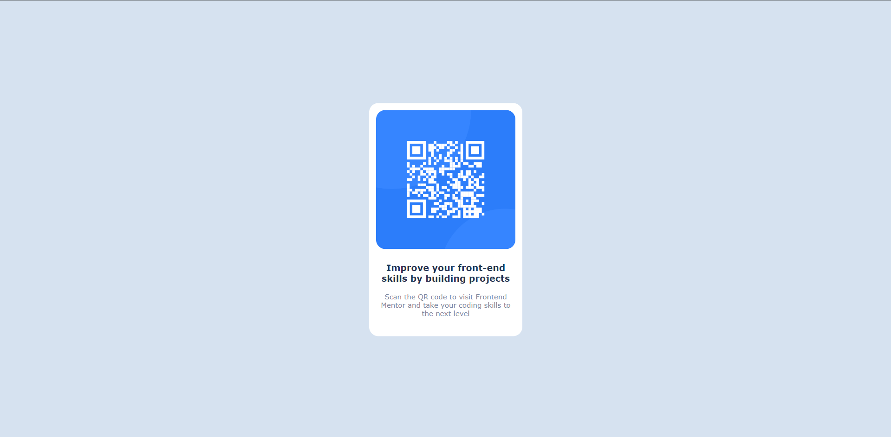

# Frontend Mentor - QR code component solution

This is a solution to the [QR code component challenge on Frontend Mentor](https://www.frontendmentor.io/challenges/qr-code-component-iux_sIO_H). Frontend Mentor challenges help you improve your coding skills by building realistic projects. 

## Table of contents

- [Overview](#overview)
  - [Screenshot](#screenshot)
  - [Links](#links)
- [My process](#my-process)
  - [Built with](#built-with)
- [Author](#author)

## Overview

### Screenshot

My design on a _**desktop**_:

My design on a _**mobile**_:

### Links

- Solution URL: [Link](https://github.com/VandorpKe/qr_code_component)
- Live Site URL: [Link](https://qr-code-component-eight-lime.vercel.app/)

## My process

### Built with

- Semantic HTML5 markup
- CSS custom properties
- Flexbox
- CSS Grid
- Mobile-first workflow
- Webstorm

## Author

- Frontend Mentor - [@VandorpKe](https://www.frontendmentor.io/profile/VandorpKe)
